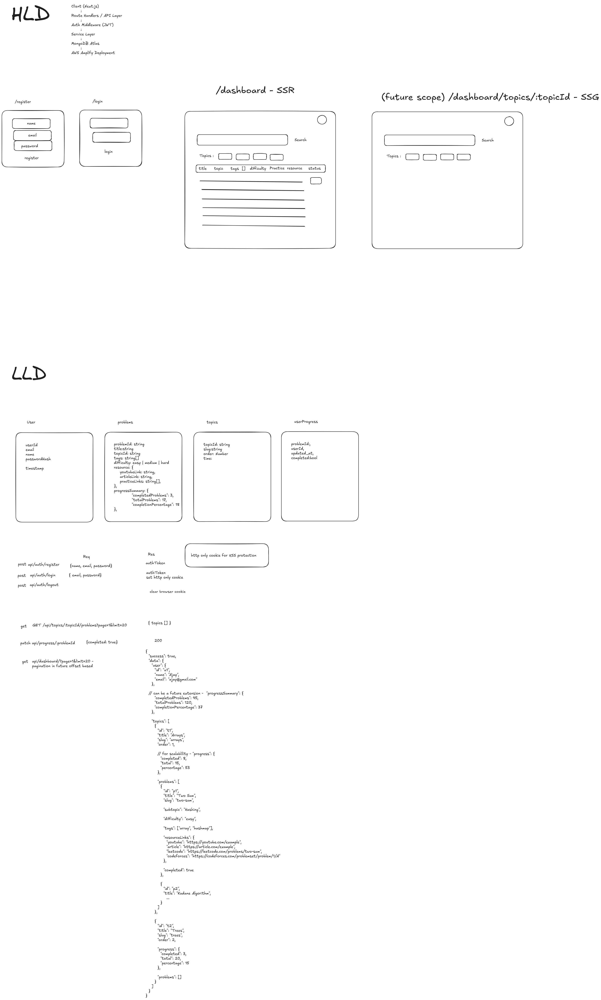

This is a [Next.js](https://nextjs.org) project bootstrapped with [`create-next-app`](https://nextjs.org/docs/app/api-reference/cli/create-next-app).

## Getting Started

First, run the development server:

```bash
npm run dev
# or
yarn dev
# or
pnpm dev
# or
bun dev
```

Open [http://localhost:3000](http://localhost:3000) with your browser to see the result.

## Architecture (HLD & LLD)



## Design Decisions

### Separate User Progress Collection

I kept user progress in a separate collection instead of storing completed problems directly inside the user document. Since progress data updates frequently, separating it keeps user documents smaller and makes updates simpler and more scalable.

---

### Separate Topics and Problems

Topics and problems were modeled separately to keep the structure flexible and easier to maintain. A topic can contain multiple problems, and this structure also makes topic-wise filtering and pagination easier to implement.

---

### JWT Authentication with HTTP-only Cookies + Securing from XSS attacks

JWT-based authentication was used with secure HTTP-only cookies. This keeps the authentication flow stateless and works well for scalable deployments since no server-side session storage is required.

---

### SSR for Dashboard

The dashboard was rendered using SSR because it contains user-specific progress data that should always be up to date after login. This also keeps authentication and protected data handling on the server side.

---

### SSG Consideration for Topic Pages - Future Consideration

Topic detail pages can be converted to SSG in the future since topic content changes very rarely. This can reduce server load and improve performance using CDN caching.

---

### Pagination - Future Considerations

Even though the current dataset is small, APIs were designed with pagination support (`page` and `limit`) so the system can handle larger datasets more efficiently in the future.

---

## Scalability Considerations

* Added separate collections for users, topics, problems, and user progress to avoid oversized documents.
* APIs were designed in a stateless way using JWT authentication, making horizontal scaling easier.
* Database indexing can be added on fields like `userId`, `problemId`, and `topicId` for faster lookups.
* Topic pages can later be cached or statically generated since they do not change frequently.
* If traffic grows significantly, Redis caching and cursor-based pagination can be introduced.
* Cursor Based pagination

